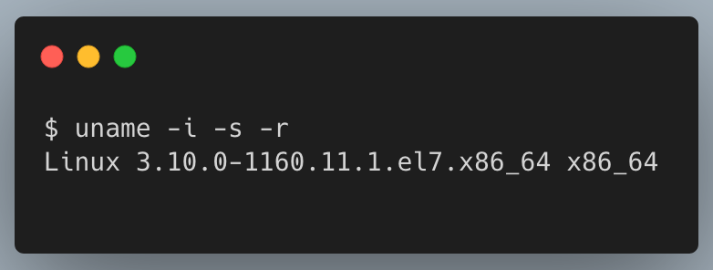
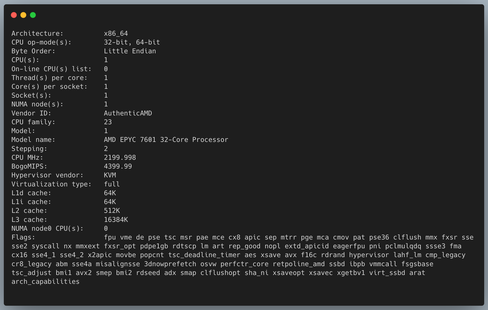
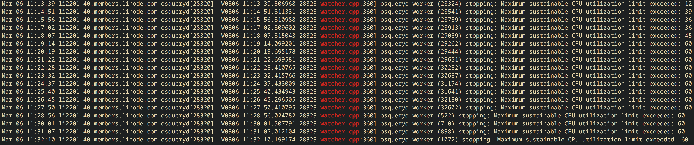
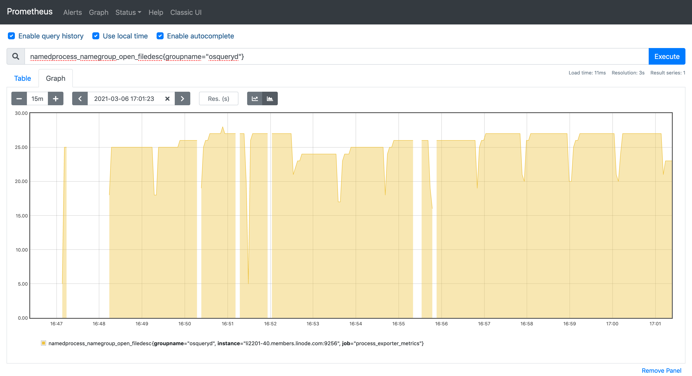
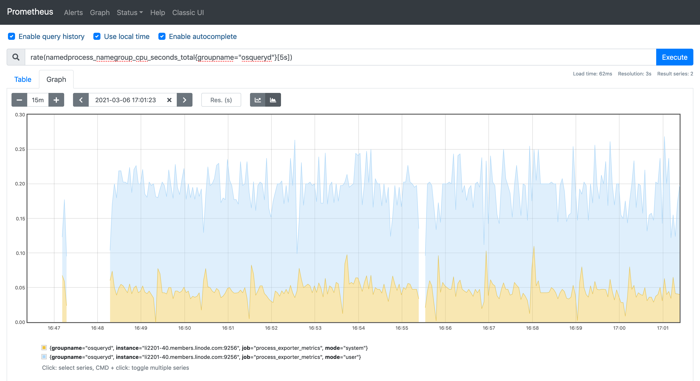
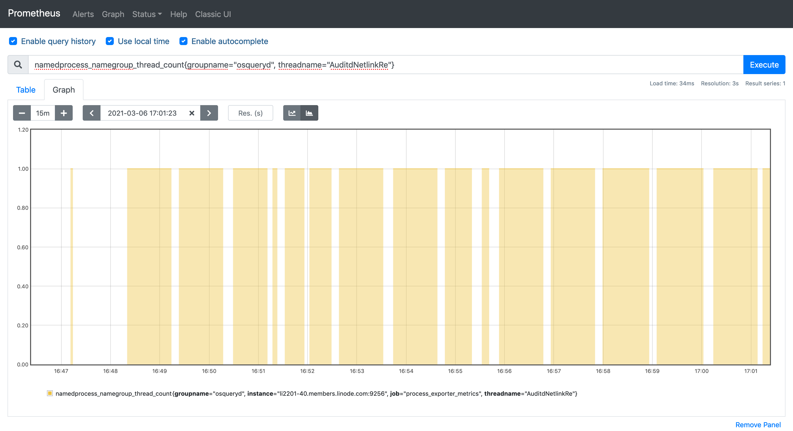
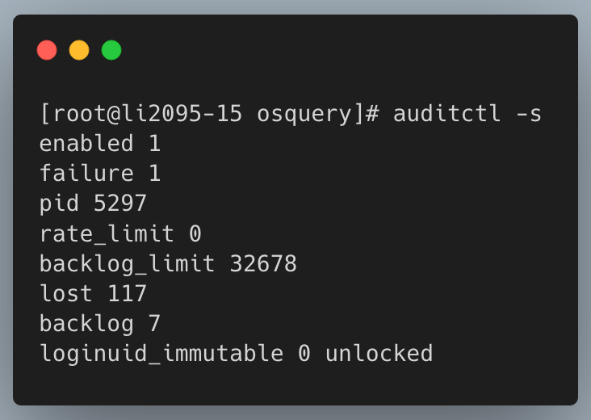
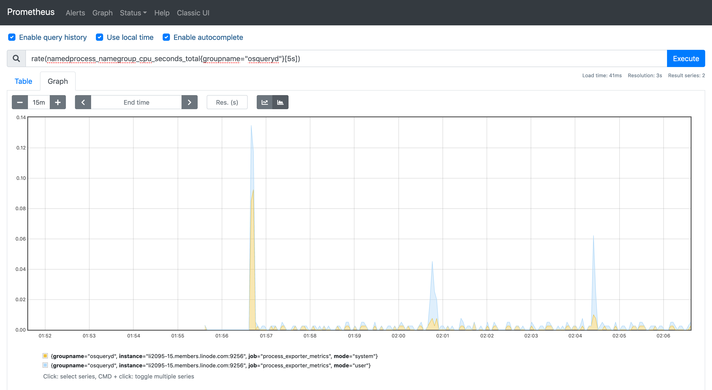
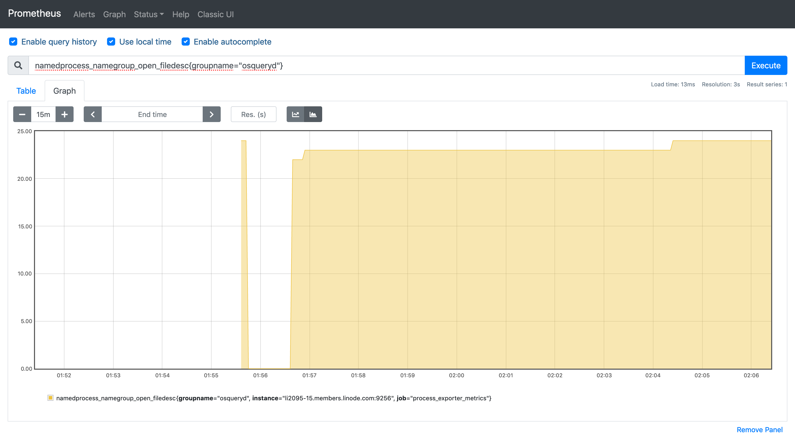
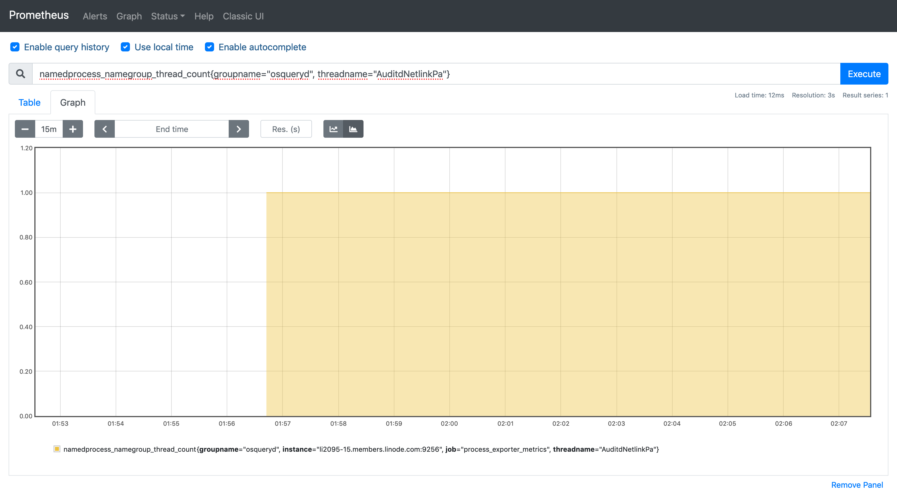

# osquery Benchmarks

| Item | Value |
|------|-------|
| osqueryd version | `osqueryd version 4.6.0` |
| config | [osquery.conf](https://gist.github.com/prateeknischal/3b2038ec080f1dd1b9510ffb5f9cf909) |
| events monitored | fim, process and user |
| OS version | Centos 7 |
| Workload | issuing 2048 bit RSA certificates using [cloudflare/cfssl](https://github.com/cloudflare/cfssl) |
| No of vcpu | 1 |
| Memory | 1G |




## Vanilla osquery with audit
### Osquery config schedule
```json
"schedule": {
  "file_events": {
    "query": "SELECT path as target_path, time, executable, operation AS action, pid, process_file_events.auid, users.username FROM process_file_events INNER JOIN users ON process_file_events.auid=users.uid WHERE process_file_events.auid != 4294967295",
    "interval": 10,
    "removed": false
  },
  "process_events": {
    "query": "SELECT pid, path, cmdline, auid, users.username, parent, syscall FROM process_events INNER JOIN users ON process_events.auid=users.uid WHERE auid!=4294967295",
    "interval": 10,
    "removed": false
  },
  "user_events": {
    "query": "SELECT u.auid, username, u.pid, u.message, u.type, u.path, u.terminal, u.eid FROM user_events u LEFT JOIN users ON auid=users.uid WHERE NOT (u.type>=1102 AND u.type<=1104) AND u.type != 1106 AND NOT (u.type >= 1109 AND u.type <= 1110);",
    "interval": "10",
    "removed": "false"
  }
}
```

### Observed events
The osqueryd daemon was regularly getting killed by the watchdog as it was
exceeding the cpu usage limits. And with that, a lot of events were registered
as lost in the audit status `auditctl -s` as well.

#### CPU respwans




#### CPU utilization




## Using Linux Audit rules

#### CPU respaws

No CPU respawns were observed. The number of lost logs (likely due to initial
osquery run with vanilla rules)


#### CPU utilization




